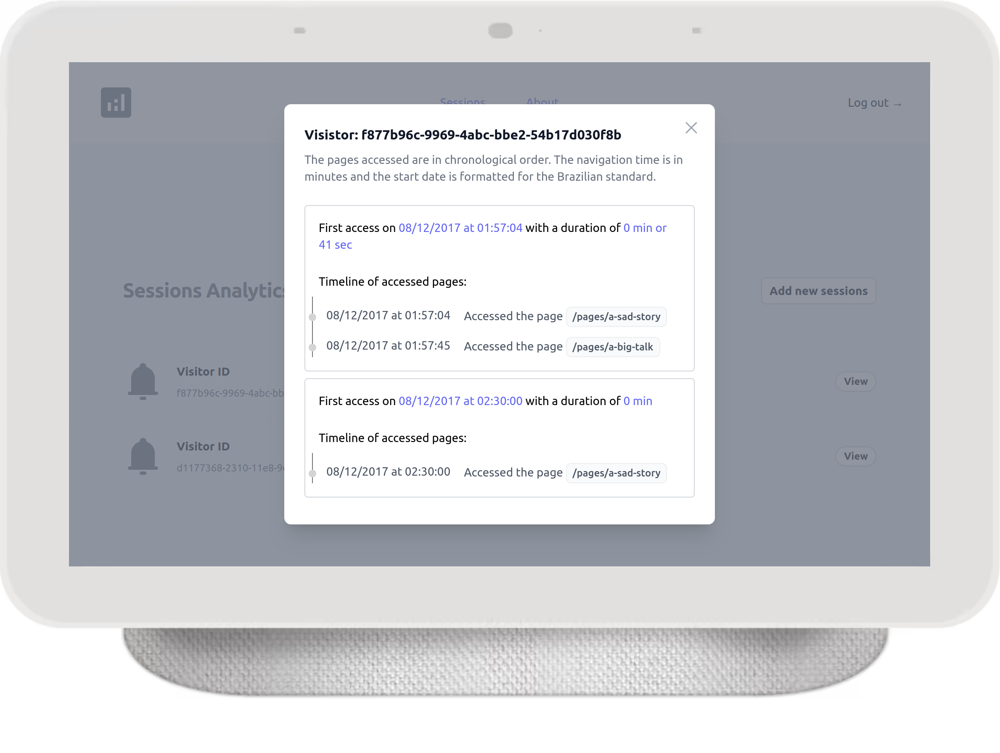

# Sessions Analytics - Tech challenger

## Challenge

[Challenger description](docs/description.md)

## General Description

The goal of this challenger is to implement a new analytics feature called "Sessions Analytics." Given a set of data consisting of individual web page visits and visitor IDs, the objective is to generate a list of sessions for each visitor.

## Preview



## local installation

To install this project on your local machine and follow the steps below:

### You must use `node version 16` to run this project.

1. Clone the repository from GitHub:
```git
   git clone https://github.com/lnfernandobr/sessions-analytics.git
```
2. Access the project folder:
```bash
cd sessions-analytics
```

3. If you use nvm, you can switch to node 16. if you don't use it, you'll need to change to version 16 to work properly
```bash
nvm use 16
```
4. Install the project's dependencies: (You must use yarn to install all dependencies, including dependencies from packages project)
```bash
yarn install
```
5. To run both the client and the server, you can run the `start` script in the root folder:
```bash
yarn start
```

After following these steps, the server will be available at http://localhost:5000 and the client at http://localhost:3000.

## Stack

**Client:**

- React.JS
- TailwinCSS
- React Router Dom
- React Toastify
- Axios
- Headless UI
- Hero Icons
- React Query
- Date FNS

**Server:**

- Express
- Mongoose (MongoDB)
- Jsonwebtokens
- Jest

**DevOps:**

- Monorepo
- ESlint
- Prettier
